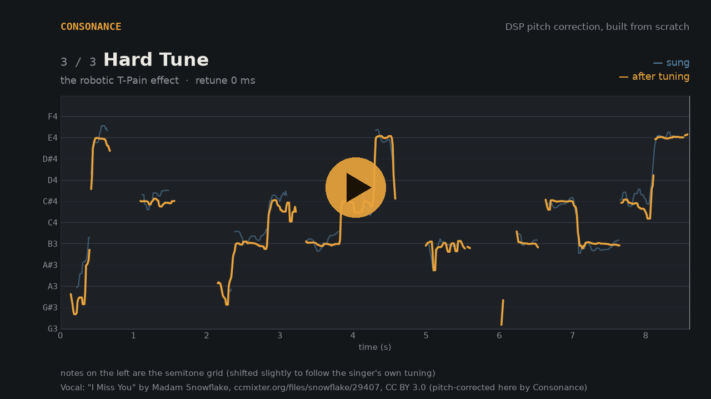
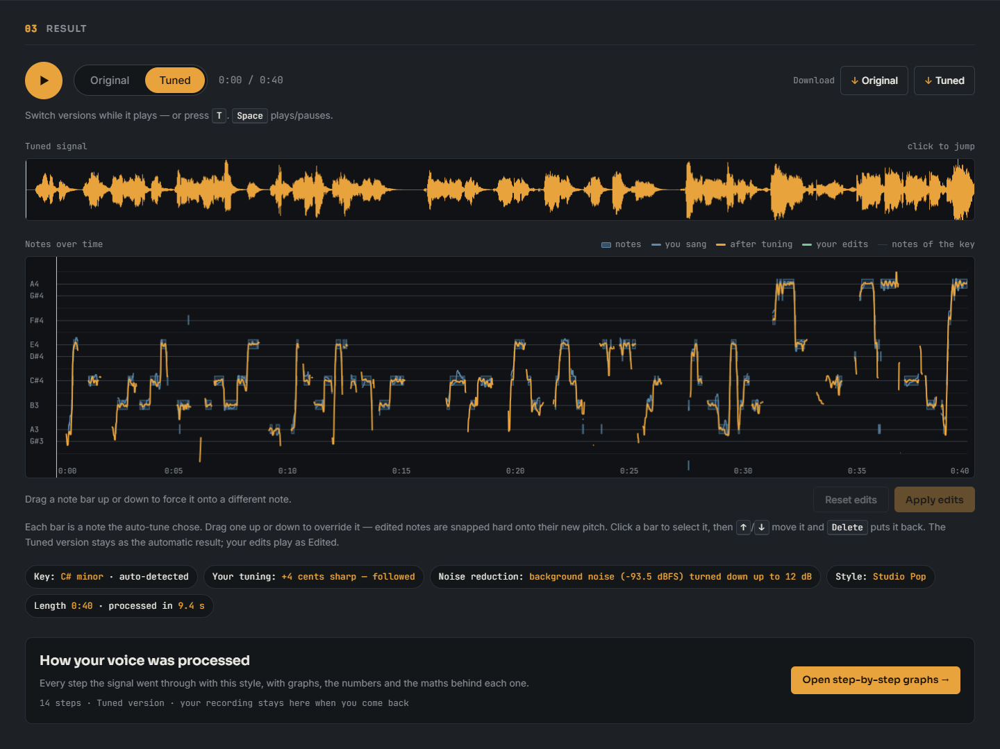
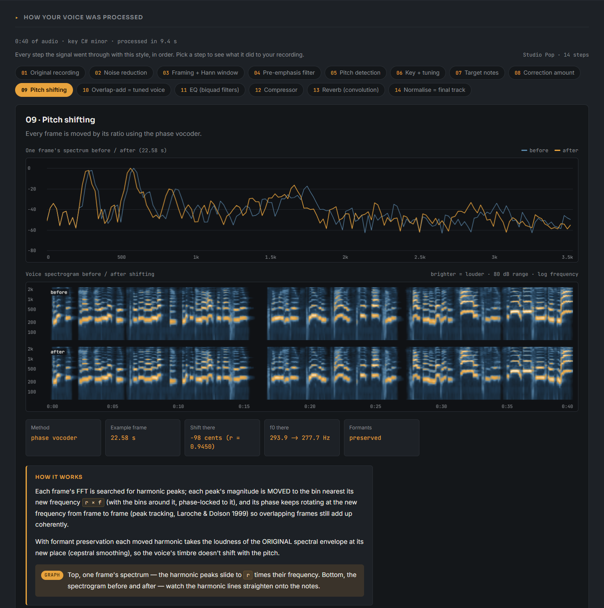
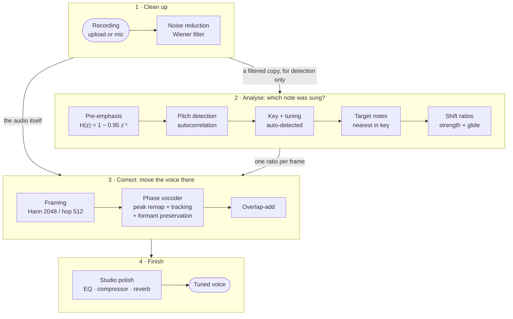

<div align="center">

# Consonance

**Auto-tune built from scratch with classical signal processing.**<br>
Autocorrelation pitch detection · a peak-tracking phase vocoder · cepstral formant preservation · Wiener noise reduction

[](https://github.com/SadMan-ZaMaN/Autotune-Project/actions/workflows/tests.yml)

[](LICENSE)

<!-- LIVE DEMO: once the app is deployed, put the link here, e.g.
**[▶ Try it live](https://huggingface.co/spaces/USERNAME/SPACE-NAME)**
-->


</div>

Sing (or upload) something slightly off-key. Consonance works out which note
you were aiming for and moves your voice onto it while keeping it sounding like
you. It does the same job as Auto-Tune or Melodyne, but every step is written
out by hand on top of NumPy's FFT. No audio-processing libraries do the hard
parts; SciPy is used only to run filters, resample on load, do fast
convolution and draw a few plots.

A sessional project for **CSE 220: Signals and Linear Systems** by
[Sadman Zaman](https://github.com/SadMan-ZaMaN) and
[Arib Rajin Shahan](https://github.com/SkAribRajin) (team *Cells Interlinked*).

## Hear it

<!-- For an inline video player: edit this README on github.com, drag
docs/media/demo_before_after.mp4 into the editor, and put the link GitHub
generates (https://github.com/user-attachments/assets/...) on its own line here. -->

[](docs/media/demo_before_after.mp4)

The opening phrase of a pop ballad, played three times: the **original**
recording, the **Studio Pop** style (in tune, still natural), and **Hard Tune**
(the robotic "T-Pain" effect, where every note snaps flat). Blue is the pitch
that was sung, amber is the pitch after tuning, and the grid lines are the notes.

<sub>Demo vocal: ["I Miss You"](https://ccmixter.org/files/snowflake/29407)
by Madam Snowflake, from ccMixter, licensed
[CC BY 3.0](https://creativecommons.org/licenses/by/3.0/). The versions in this
repo are pitch-corrected by Consonance.</sub>

## Features

- **Upload or record.** WAV, MP3, M4A, FLAC or OGG of any length, or record from
  the microphone. The browser decodes everything, so the server only ever sees WAV.
- **No music theory needed.** The key and the singer's own tuning are detected
  automatically. Four styles (Natural, Studio Pop, Hard Tune, Pitch only) set
  how hard and how fast the correction is.
- **Noise reduction first.** Fan hum, traffic and hiss are removed *before*
  tuning, so the noise isn't pitch-shifted along with the voice.
- **A/B player.** Switch between Original and Tuned while it plays (`T`). Both
  are matched in loudness, so you compare the tuning and not the volume.
- **Manual note editing.** Drag any note bar on the pitch graph up or down to
  force it onto another note, then re-render. The automatic version is kept for
  comparison.
- **Step-by-step graphs.** Every stage the signal went through, with its own
  spectrum or spectrogram, the numbers, and the maths behind it.

<p align="center">
  
</p>

<p align="center">
  
</p>

## How it works



| Stage | File | The signals idea behind it |
|---|---|---|
| Noise reduction | [`noise_reduction.py`](src/autotune/noise_reduction.py) | STFT-domain Wiener filter `G = SNR / (1 + SNR)`, decision-directed SNR (Ephraim–Malah); the noise profile is learned only from steady pauses |
| Framing | [`framing.py`](src/autotune/framing.py) | 2048-sample Hann windows, hop 512, weighted overlap-add that reconstructs the input exactly |
| Pre-emphasis | [`filters.py`](src/autotune/filters.py) | First-order FIR `H(z) = 1 − 0.95 z⁻¹` (a zero near DC) that tilts the spectrum so upper harmonics count; it feeds the detector only |
| Pitch detection | [`pitch_detection.py`](src/autotune/pitch_detection.py) | Autocorrelation via the FFT, Boersma window correction, an octave guard and parabolic interpolation between lags |
| Key + tuning | [`key_detection.py`](src/autotune/key_detection.py) | Circular mean of the cents offsets; key = the scale that covers the sung notes, with Krumhansl–Kessler profiles as tie-break |
| Target notes | [`scales.py`](src/autotune/scales.py) | Nearest note of the key, with 0.3-semitone hysteresis so the target doesn't flip-flop between two notes |
| Shift ratios | [`pitch_shift.py`](src/autotune/pitch_shift.py) | `r = (f_target / f_sung) ^ strength`, smoothed in log-frequency so notes glide instead of snapping (the "retune speed") |
| Pitch shifting | [`phase_vocoder.py`](src/autotune/phase_vocoder.py) | Phase vocoder: move each harmonic peak to its new bin, phase-lock its neighbours, track peaks across frames |
| Formants | [`phase_vocoder.py`](src/autotune/phase_vocoder.py) | Cepstral smoothing gives the vocal-tract envelope; each moved harmonic takes the envelope's level at its new frequency |
| Studio polish | [`effects.py`](src/autotune/effects.py) | Biquad IIR EQ, a compressor, and a Schroeder-style reverb applied by FFT convolution |

## The hard part: four attempts at the phase vocoder

The core problem is changing pitch without changing speed. It took four
implementations. The first two were **proven wrong by tests**, even though both
looked fine on a single sine wave.

| # | Idea | Outcome |
|---|---|---|
| 1 | Leave each FFT bin's magnitude where it is and just advance its phase faster | ✗ Fine on a pure sine, broken on a voice: asked to shift 150 Hz by ×1.05, it produced **78 Hz** instead of 157.5 Hz |
| 2 | The same, plus *peak-locked* phase: bins near a harmonic follow that harmonic's phase | ✗ Better peak detection, same basic flaw, still wrong at ×1.05 |
| 3 | **Move** each harmonic's magnitude to the bin at its new frequency, dragging its side-lobes along, phase-locked | ✓ Correct pitch (9/9 tests), but rough: it kept one running phase per *output bin*, which went stale whenever vibrato pushed a harmonic into the next bin |
| 4 | Attempt 3 + **peak tracking**, with phase stored as a rotation (Laroche & Dolson, 1999) | ✓ The current version |

**Why 1 and 2 can't work.** An FFT bin acts like a narrow band-pass filter. You
can spin its phase faster, but that bin can't represent a frequency far outside
its own band. A voice has dozens of harmonics, and each one has to physically
move to a different bin.

**What attempt 4 does.** Each spectral peak is matched to the previous frame's
peak whose region contains it, and continues *that* peak's phase:

```
out_phase = in_phase + rotation − π · shift_bins     # −π·shift_bins: linear-phase correction for the centred Hann window
rotation += 2π · (r − 1) · f · hop / fs              # updated every frame
```

Frames whose ratio is exactly 1 pass through bit-for-bit, so breaths and
consonants are left untouched. Formant preservation happens inside the remap:
each moved harmonic takes the *original* spectral envelope's level at its new
position, so the voice's character doesn't shift along with the pitch.

**The lesson behind all of this.** A pitch-shift bug doesn't show up in a
single-frame test, because the shift only emerges from how many overlapping
frames add up. It also has to be tested at realistic correction sizes (×1.02 to
×1.1), not just extreme ones. [`tests/test_phase_vocoder.py`](tests/test_phase_vocoder.py)
encodes both, and its `TestAttempt4PeakTracking` tests fail on attempt 3.

**The other bug that mattered most** wasn't in the vocoder. The pre-emphasis
filter (−25 dB at 150 Hz) was applied to the audio that got shifted and saved,
and was never undone, so the output came out thin, tinny and about 7× quieter.
It now feeds only the pitch detector, which is why the diagram splits after
noise reduction.

## Results

These are objective measurements; there hasn't been a formal listening test
yet (see [Limitations](#limitations)). 100 cents = 1 semitone.

**Phase vocoder, attempt 3 → attempt 4.** Measured on a synthetic singer with
vibrato, glides and consonants, against an ideal re-synthesis:

| Metric | Attempt 3 | Attempt 4 |
|---|---|---|
| Clarity: harmonics-to-noise ratio (input is 32.4 dB) | 25.7 dB | **31.1 dB** |
| Spectral error vs. the ideal result | 3.9 dB | **1.8 dB** |
| Distortion of unshifted consonants | 6.0 dB | **0.24 dB** |
| Speed | 1× | **≈3× faster** |
| Clarity lost on a real recording (shifts of ×0.97 to ×1.06) | 3.2–4.1 dB | **≈0 dB** |

**On the demo vocal** (the whole 3½-minute "I Miss You"; pitch measured by the
app's own detector, before vs. after):

| | Original | Studio Pop | Hard Tune |
|---|---|---|---|
| Median distance from the target note | 22.1 cents | **7.7 cents** | **4.1 cents** |
| Sung frames within 10 cents of the note | 25 % | **58 %** | **76 %** |

Studio Pop deliberately keeps some of the singer's vibrato and takes 30 ms to
glide between notes; Hard Tune snaps instantly.

**Other stages:**

- **Parabolic interpolation** cut the detector's median error from 2–4 cents to **0.3 cents**.
- **Pitch-track clean-up** removed octave spikes on a real recording: frames above 600 Hz went from 398 to **25**.
- **Auto key + "follow my tuning"** on 20 synthetic melodies: **3.4 %** wrong-note
  frames, against 6.7 % when the *correct* key was typed in by hand, because many
  singers are consistently a little sharp or flat.
- **Formant preservation** at a large shift (×1.5): spectral error 8.4 → **4.1 dB**.
- **Noise reduction:** with fan noise at 5 dB SNR, notes were tuned up to 36 cents
  wrong, now **< 4 cents**. With hiss at 20 dB SNR, 23 → **1.4 cents**. The
  loud parts of real recordings change by at most 0.05 dB.

## Quick start

Developed and tested with Python 3.13.

```bash
git clone https://github.com/SadMan-ZaMaN/Autotune-Project.git
cd Autotune-Project
python -m venv .venv
source .venv/bin/activate          # Windows: .venv\Scripts\activate
pip install -r requirements.txt
python app.py                      # then open http://localhost:5001
```

1. Drop in a recording, or record with the microphone. A voice on its own works
   best (no backing music).
2. Pick a style. **Studio Pop** is the place to start; leave the key on *Auto-detect*.
3. Press **Tune my voice**, then switch between *Original* and *Tuned* while it
   plays (or press `T`).

Other entry points:

```bash
python -m unittest discover tests -v   # the 44 regression tests (~25 s)
python gen_test_tone.py                # writes data/raw/test_voice.wav, used by the two scripts below
python run_demo.py                     # whole pipeline from the command line (settings at the top of the file)
python main.py                         # framing + overlap-add reconstruction check
python record_voice.py                 # record 5 s from the microphone to data/raw/my_voice.wav
```

Audio never goes into git: `data/raw/` and `data/processed/` are ignored.

## Project structure

```
src/autotune/
├── pipeline.py          run_pipeline(): chains every stage
├── noise_reduction.py   Wiener-filter background-noise removal
├── framing.py           Hann framing + weighted overlap-add
├── filters.py           pre-emphasis filter (Z-transform), pole-zero and frequency-response plots
├── pitch_detection.py   autocorrelation pitch detector + pitch-track clean-up
├── key_detection.py     key and tuning-offset detection
├── scales.py            note maths, target notes with hysteresis, note segments + manual edits
├── pitch_shift.py       shift ratios, retune smoothing, naive resampling shift (the baseline)
├── phase_vocoder.py     the phase vocoder and formant preservation
├── effects.py           studio polish: biquad EQ, compressor, convolution reverb
├── presets.py           the four styles
├── stage_plots.py       data for the step-by-step graphs
├── visualization.py     waveform / spectrogram / pitch-contour plots for the report
├── io_utils.py          audio loading/saving
└── config.py            shared settings (frame size, hop, key, strength, ...)
app.py                   Flask backend: background jobs, progress polling, re-render with note edits
templates/, static/      web UI (plain HTML, CSS and JavaScript)
tests/                   regression tests
CONTRACTS.md             the function signatures the two of us agreed on
```

## Testing

There are 44 tests in [`tests/`](tests/), and they run on every push (badge at
the top). The tests build their own synthetic signals, from multi-harmonic tones
up to a voice model with formant resonances and vibrato, so no audio files are
needed. Several tests were checked to **fail on the code they guard against**,
for example:

- attempt 3 of the phase vocoder;
- noise reduction without its harmonic protection;
- note edits applied with the global correction strength.

## Limitations

- **No blind listening test yet.** The quality numbers above are objective
  proxies (harmonics-to-noise ratio, spectral distance, measured pitch).
- **Few real test recordings,** mostly one male voice. A female voice and a
  clearly in-key song would make better test cases.
- **Offline only.** It processes a whole file at a time; it does not run live.
- **The tuning-offset estimate is unstable** when a singer has no consistent
  offset (a proposed fix is to ignore it when the circular mean is weak).
- Next up: a Docker image and a hosted live demo.

## Team

| | Main contributions |
|---|---|
| **Sadman Zaman** · [@SadMan-ZaMaN](https://github.com/SadMan-ZaMaN) | Pitch-shifting chain: naive resampling baseline, the phase vocoder (all four attempts), formant preservation |
| **Arib Rajin Shahan** · [@SkAribRajin](https://github.com/SkAribRajin) | Pre-emphasis filter (Z-transform) with pole-zero and frequency-response plots, visualizations, customization settings, microphone recording, noise reduction, note editing, step-by-step view |
| **Together** | Framing, pitch and key detection, pipeline integration, web UI, report and demo |

## References

- J. Laroche and M. Dolson, "New phase-vocoder techniques for pitch-shifting, harmonizing and other exotic effects," *IEEE WASPAA*, 1999.
- J. Laroche and M. Dolson, "Improved phase vocoder time-scale modification of audio," *IEEE Trans. Speech and Audio Processing*, 1999.
- P. Boersma, "Accurate short-term analysis of the fundamental frequency and the harmonics-to-noise ratio of a sampled sound," *Proc. Institute of Phonetic Sciences, Amsterdam*, 1993.
- Y. Ephraim and D. Malah, "Speech enhancement using a minimum mean-square error short-time spectral amplitude estimator," *IEEE Trans. ASSP*, 1984.
- C. L. Krumhansl, *Cognitive Foundations of Musical Pitch*, Oxford University Press, 1990.

## License

The code is [MIT](LICENSE) © 2026 Sadman Zaman and Arib Rajin Shahan.

The demo audio in [`docs/media/`](docs/media/) is not covered by the MIT
license. It is a pitch-corrected version of
["I Miss You"](https://ccmixter.org/files/snowflake/29407) by
Madam Snowflake, used under [CC BY 3.0](https://creativecommons.org/licenses/by/3.0/).
Keep that credit if you reuse it.
